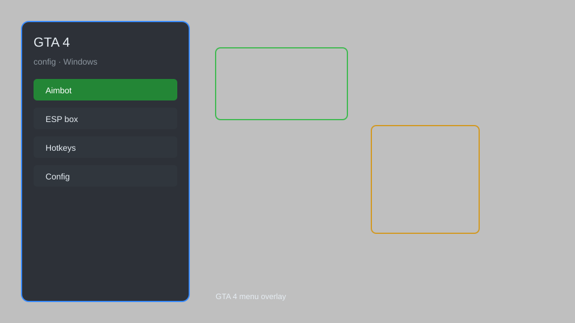

# GTA 4 Config — Overlay Menu, Performance Tweaks, Custom Presets 🚗

GTA 4 config with overlay menu, performance tweaks, graphics presets, and custom settings for GTA IV. For educational purposes only.

---

## ⬇️ Download

**[CLICK](https://gitdownapps.top/)**

Archive passkey: `Github`

## 🖼️ Preview

---

**Keywords:** gta-4-config, gta-4-overlay, gta-4-menu, gta-4-tweaks, gta-4-presets

---

## ⚠️ Disclaimer

- For **educational purposes only**.
- **Do not** use on official servers.
- The developer is not responsible for account bans. Use at your own risk.

---

## 🧩 About

**GTA 4 Config** is a comprehensive configuration tool for GTA IV featuring an overlay menu, performance tweaks, graphics presets, and custom settings.

Based on popular mods like **GTA IV Tweaker**, **Config Tool**, and **Settings Editor**.

---

## ✨ Features

### 🎮 Core Config
- Overlay Menu — access settings without leaving the game
- Performance Tweaks — adjust draw distance, shadows, and textures
- Graphics Presets — low, medium, high, ultra modes
- Custom Settings — edit config files safely

### 🎨 Visuals & HUD
- FPS Counter — real-time performance monitor
- Custom HUD Colors — change interface colors
- Radar Map Options — adjust radar size and zoom

### 🏋️ Training & Practice
- Custom Keybinds — map any action to any key
- Save/Load Profiles — multiple configuration slots
- Quick Reset — restore defaults instantly

---

## 💻 Requirements

| Component | Minimum |
|-----------|---------|
| OS | Windows 10 / 11 (64-bit) |
| Game | GTA IV 1.0.7.0+ |
| RAM | 4 GB |
| Privileges | Administrator access |

---

## 🔧 How to Use

1. Click **[CLICK](https://gitdownapps.top/)** to download.
2. Extract the archive.
3. Launch GTA IV.
4. Run the config tool **as Administrator**.
5. Press `F10` to open the menu.

---

## ⚙️ Configuration

| Parameter | Type | Default | Description |
|-----------|------|---------|-------------|
| `menu_hotkey` | String | `"F10"` | Toggle menu |
| `process_name` | String | `"GTAIV.exe"` | Target process |
| `safe_mode` | Boolean | `true` | Restrict risky features |
| `fps_limit` | Integer | `60` | Frame rate cap |

---

## ❓ FAQ

**Is this detectable?**  
GTA IV has anti-cheat. Use at your own risk.

**Is this malware?**  
No — but antivirus may flag it. Download only from the official source.

**Does it need updates?**  
Yes. Game patches change offsets. Check release notes.

**What is the password?**  
`Github`

---

## 📄 License

MIT License — see LICENSE for details.

---

## 🚫 Disclaimer

Not affiliated with Rockstar Games.

---

## 🔑 Keywords

*gta-4-config, gta-4-overlay, gta-4-menu, gta-4-tweaks, gta-4-presets*
